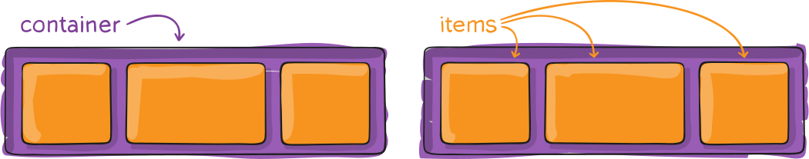
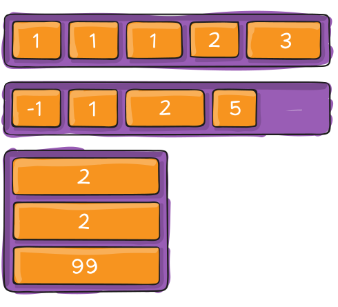
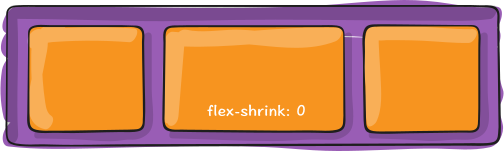

# CSS 弹性布局 {#css-flex-layout}

弹性盒子 Flexbox 是一种用于**按行或按列布局元素**的**一维布局方法**，元素可以**膨胀以填充额外的空间, 收缩以适应更小的空间**。

通常使用弹性盒子 Flexbox 来进行布局的方案称之为弹性布局(flex layout)。

## 基本概念 {#basic-concepts}

设置 flex 布局的元素叫 Flex 容器（`flex container`），称为“容器”。它的所有直接子元素自动成为容器成员，称为 Flex 项目（`flex item`），简称"项目"。



当 `flex container` 中的子元素变成了 `flex item` 时, 具备如下特点:

- `flex item` 的布局将受 `flex container` 属性的设置来进行控制和布局
- `flex item` 不再严格区分块级元素和行内级元素
- `flex item` 默认情况下是包裹内容的, 但是可以设置宽度和高度

使用 display 属性为 `flex` 或者 `inline-flex` 的元素被称为 `flex container`。

```css
.container {
  display: flex;
  /* 或者 */
  display: inline-flex;
}
```

- `display: flex`： `flex container` 以 block-level 形式存在
- `display: inline-flex`： `flex container` 以 inline-level 形式存在

## flex 布局模型 {#flex-layout-model}

容器默认存在两根轴：水平的主轴（`main axis`）和垂直的交叉轴（`cross axis`）。

主轴的开始位置（与边框的交叉点）叫做 `main start`，结束位置叫做 `main end`；交叉轴的开始位置叫做 `cross start`，结束位置叫做 `cross end`。

项目默认沿主轴排列。单个项目占据的主轴空间叫做 `main size`，占据的交叉轴空间叫做 `cross size`。


## 容器属性 {#container-properties}

下面 6 个属性设置在容器上。

::: info 容器属性的取值

- [`flex-direction`](#flex-direction) 决定主轴方向（即项目的排列方向）。
- [`flex-wrap`](#flex-wrap) 决定如果一条轴线排不下，如何换行。
- [`flex-flow`](#flex-flow) 是 `flex-direction` 属性和 `flex-wrap` 属性的简写形式。
- [`justify-content`](#justify-content) 定义项目在主轴上的对齐方式。
- [`align-items`](#align-items) 定义在交叉轴上如何对齐。
- [`align-content`](#align-content) 定义了多根轴线的对齐方式。如果项目只有一根轴线，该属性不起作用。

:::

### `flex-direction` 属性 {#flex-direction}

默认情况下，flex items 是沿着 main axis（主轴）从 main start 开始往 main end 方向排布。

[`flex-direction` 属性](https://developer.mozilla.org/zh-CN/docs/Web/CSS/flex-direction)决定主轴 `mian axis` 的方向。

```css
.flex-container {
  flex-direction: row | row-reverse | column | column-reverse;
}
```


::: info `flex-direction` 属性的取值

- `row`（默认值）：主轴为水平方向，起点在左端。
- `row-reverse`：主轴为水平方向，起点在右端。
- `column`：主轴为垂直方向，起点在上沿。
- `column-reverse`：主轴为垂直方向，起点在下沿。

:::

### `flex-wrap` 属性 {#flex-wrap}

默认情况下，项目都排在一条线（又称"轴线"）上。[`flex-wrap` 属性](https://developer.mozilla.org/zh-CN/docs/Web/CSS/flex-wrap)定义，如果一条轴线排不下，如何换行。


```css
.flex-container {
  flex-wrap: nowrap | wrap | wrap-reverse;
}
```

::: info `flex-wrap` 属性的取值

- `nowrap`（默认）：不换行。
- `wrap`：换行，第一行在上方。
- `wrap-reverse`：换行，第一行在下方。

:::

### `flex-flow` 属性 {#flex-flow}

[`flex-flow` 属性](https://developer.mozilla.org/zh-CN/docs/Web/CSS/flex-flow)是 `flex-direction` 属性和 `flex-wrap` 属性的简写形式，默认值为 `row nowrap`。

```css
.flex-container {
  flex-flow: <flex-direction> || <flex-wrap>;
}
```

::: warning 注意
`flex-direction`、`flex-wrap` 顺序任意, 并且都可以省略。
:::

### `justify-content` 属性 {#justify-content}

[`justify-content` 属性](https://developer.mozilla.org/zh-CN/docs/Web/CSS/justify-content)定义了项目在主轴上的对齐方式。

```css
.flex-container {
  justify-content: flex-start | flex-end | center | space-between | space-around
    | space-evenly;
}
```


它可能取 5 个值，具体对齐方式与轴的方向有关。下面假设主轴为从左到右。

::: info `justify-content` 属性的取值

- `flex-start`（默认值）：左对齐
- `flex-end`：右对齐
- `center`： 居中
- `space-between`：两端对齐，项目之间的间隔都相等。
- `space-around`：每个项目两侧的间隔相等，所以，项目之间的间隔比项目与边框的间隔大一倍。
- `space-evenly`：每个项目之间的间隔相等，项目与边框之间的间隔也相等。

:::

### `align-items` 属性 {#align-items}

[`align-items` 属性](https://developer.mozilla.org/zh-CN/docs/Web/CSS/align-items)定义项目在交叉轴上如何对齐。

```css
.flex-container {
  align-items: flex-start | flex-end | center | baseline | stretch;
}
```


它可能取 5 个值。具体的对齐方式与交叉轴的方向有关，下面假设交叉轴从上到下。

::: info `align-items` 属性的取值

- `flex-start`：交叉轴的起点对齐。
- `flex-end`：交叉轴的终点对齐。
- `center`：交叉轴的中点对齐。
- `baseline`: 项目的第一行文字的基线对齐。
- `stretch`（默认值）：如果项目未设置高度或设为`auto`，将占满整个容器的高度。

:::

### `align-content` 属性 {#align-content}

[`align-content` 属性](https://developer.mozilla.org/zh-CN/docs/Web/CSS/align-content)定义了多根轴线的对齐方式。如果项目只有一根轴线，该属性不起作用。

```css
.flex-container {
  align-content: flex-start | flex-end | center | space-between | space-around |
    stretch;
}
```


该属性可能取 6 个值。

::: info `align-content` 属性的取值

- `flex-start`：与交叉轴的起点对齐。
- `flex-end`：与交叉轴的终点对齐。
- `center`：与交叉轴的中点对齐。
- `space-between`：与交叉轴两端对齐，轴线之间的间隔平均分布。
- `space-around`：每根轴线两侧的间隔都相等。所以，轴线之间的间隔比轴线与边框的间隔大一倍。
- `stretch`（默认值）：轴线占满整个交叉轴。

:::

## 项目属性 {#item-properties}

下面 6 个属性设置在容器上。

::: info 项目属性的取值

- [`order`](#order) 定义项目的排列顺序。
- [`flex-grow`](#flex-grow) 定义项目的放大比例，默认为 0，即如果存在剩余空间，也不放大。
- [`flex-shrink`](#flex-shrink) 定义了项目的缩小比例，默认为 1，即如果空间不足，该项目将缩小。
- [`flex-basis`](#flex-basis) 定义了在分配多余空间之前，项目占据的主轴空间（main size）。浏览器根据这个属性，计算主轴是否有多余空间。它的默认值为 `auto`，即项目的本来大小。
- [`flex`](#flex) 是 `flex-grow`, `flex-shrink` 和 `flex-basis` 的简写，默认值为 `0 1 auto`。后两个属性可选。
- [`align-self`](#align-self) 允许单个项目有与其他项目不一样的对齐方式，可覆盖 `align-items` 属性。默认值为 `auto`，表示继承父元素的 `align-items` 属性，如果没有父元素，则等同于 `stretch`。

:::

### `order` 属性 {#order}

[order 属性](https://developer.mozilla.org/zh-CN/docs/Web/CSS/order)定义项目的排列顺序。数值越小，排列越靠前，默认为 `0`。

```css
.item {
  order: <integer>;
}
```



### `flex-grow` 属性 {#flex-grow}

[`flex-shrink` 属性](https://developer.mozilla.org/zh-CN/docs/Web/CSS/flex-shrink)定义了项目的缩小比例，默认为 1，即如果空间不足，该项目将缩小。

```css
.item {
  flex-shrink: <number>; /* default 1 */
}
```



如果所有项目的 `flex-shrink` 属性都为 1，当空间不足时，都将等比例缩小。

如果一个项目的 `flex-shrink` 属性为 0，其它项目都为 1，则空间不足时，前者不缩小。

负值对该属性无效。
