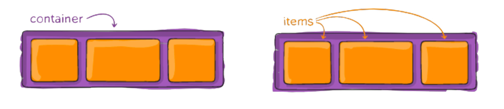
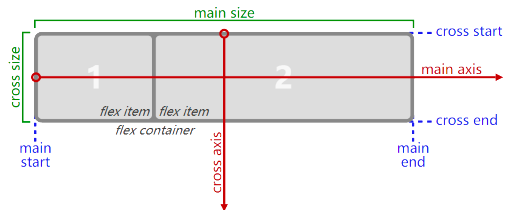
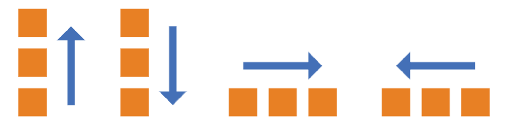

# CSS 弹性布局 {#css-flex-layout}

弹性盒子 Flexbox 是一种用于**按行或按列布局元素**的**一维布局方法**，元素可以**膨胀以填充额外的空间, 收缩以适应更小的空间**。

通常使用弹性盒子 Flexbox 来进行布局的方案称之为弹性布局(flex layout)。

## 基本概念 {#basic-concepts}

设置 flex 布局的元素叫 Flex 容器（`flex container`），称为“容器”。它的所有直接子元素自动成为容器成员，称为 Flex 项目（`flex item`），简称"项目"。



当 `flex container` 中的子元素变成了 `flex item` 时, 具备如下特点:

- `flex item` 的布局将受 `flex container` 属性的设置来进行控制和布局
- `flex item` 不再严格区分块级元素和行内级元素
- `flex item` 默认情况下是包裹内容的, 但是可以设置宽度和高度

使用 display 属性为 `flex` 或者 `inline-flex` 的元素被称为 `flex container`。

```css
.container {
  display: flex;
  /* 或者 */
  display: inline-flex;
}
```

- `display: flex`： `flex container` 以 block-level 形式存在
- `display: inline-flex`： `flex container` 以 inline-level 形式存在

## flex 布局模型 {#flex-layout-model}

容器默认存在两根轴：水平的主轴（`main axis`）和垂直的交叉轴（`cross axis`）。

主轴的开始位置（与边框的交叉点）叫做 `main start`，结束位置叫做 `main end`；交叉轴的开始位置叫做 `cross start`，结束位置叫做 `cross end`。

项目默认沿主轴排列。单个项目占据的主轴空间叫做 `main size`，占据的交叉轴空间叫做 `cross size`。



## 容器属性 {#container-properties}

下面 6 个属性设置在容器上。

::: info 容器属性的取值

- [`flex-direction`](#flex-direction) 决定主轴方向（即项目的排列方向）。
- `flex-wrap`
- `flex-flow`
- `justify-content`
- `align-items`
- `align-conten`

:::

### `flex-direction` {#flex-direction}

默认情况下，flex items 是沿着 main axis（主轴）从 main start 开始往 main end 方向排布。

`flex-direction` 属性决定主轴 `mian axis` 的方向。

```css
.flex-container {
  flex-direction: row | row-reverse | column | column-reverse;
}
```



::: tip `flex-direction` 属性的取值

- `row`（默认值）：主轴为水平方向，起点在左端。
- `row-reverse`：主轴为水平方向，起点在右端。
- `column`：主轴为垂直方向，起点在上沿。
- `column-reverse`：主轴为垂直方向，起点在下沿。

:::

## 项目属性 {#item-properties}

下面 6 个属性设置在容器上。

::: info 项目属性的取值

- `order`
- `flex-grow`
- `flex-shrink`
- `flex-basis`
- `flex`
- `align-self`

:::
