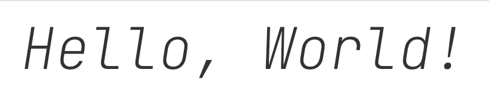

# CSS 属性 {#css-property}

## 通用 {#common}

### `cursor` {#cursor}

cursor 可以设置鼠标指针（光标）在元素上面时的显示样式。

常见的取值有：

- `default` 默认光标（通常是一个箭头）
- `pointer` 小手
- `move` 移动
- `text` 文本
- `wait` 等待
- `help` 帮助
- `not-allowed` 禁止
- `none` 无光标

  ```html
  <style>
    div.cursor {
      width: 100px;
      height: 100px;
      background-color: #eaeaea;
      cursor: pointer;
    }
  </style>

  <div class="cursor"></div>
  ```

### `z-index` {#z-index}

[`z-index`](https://developer.mozilla.org/zh-CN/docs/Web/CSS/z-index) 属性用来设置定位元素的层叠顺序（仅对定位元素有效，即`position` 属性为 `relative`、`absolute` 和 `fixed` 的元素）

`z-index` 的取值有：

- `auto` 自动（默认值）
- `number` 整数，比如 `1`、`2`、`3` 等或 `-1`

```css
/* 关键字值 */
z-index: auto;

/* 整数值 */
z-index: 0;
z-index: 3;
z-index: 289;
z-index: -1; /* 使用负值降低优先级 */

/* 全局值 */
z-index: inherit;
z-index: initial;
z-index: unset;
```

::: tip 比较原则

1. 如果是兄弟关系

- `z-index` 越大，层叠在越上面
- `z-index` 相等，写在后面的那个元素层叠在上面

2. 如果不是兄弟关系

- 各自从元素自己以及祖先元素中，找出最邻近的 2 个定位元素进行比较
- 而且这 2 个定位元素必须有设置 `z-index` 的具体数值
  :::

## 文本 {#text}

常见的文本属性包括：**`text-decoration`**、`text-transform`、`text-indent`、**`text-align`**、`word-spacing`、`letter-spacing` 等。

### text-decoration {#text-decoration}

[`text-decoration`](https://developer.mozilla.org/zh-CN/docs/Web/CSS/text-decoration) 是用来设置文本的修饰的。

常见的取值有：

- `none` 无修饰，使用它可以去除 `a` 元素默认的下划线。
- `underline` 下划线
- `line-through` 中横线（删除线）
- `overline` 上划线
- `blink` 闪烁

### text-transform {#text-transform}

[`text-transform`](https://developer.mozilla.org/zh-CN/docs/Web/CSS/text-transform) 用来设置文本的大小写。

常见的取值有：

- `none` 无大小写转换
- `capitalize` 首字母大写
- `uppercase` 全部大写
- `lowercase` 全部小写

### text-indent {#text-indent}

[`text-indent`](https://developer.mozilla.org/zh-CN/docs/Web/CSS/text-indent) 用来设置文本的首行缩进。

常见的取值有：

`length` 长度值，比如 `32px` 或 `2em`

### text-align {#text-align}

[`text-align`](https://developer.mozilla.org/zh-CN/docs/Web/CSS/text-align) 用来设置**行内级元素**相对它的父元素的对齐方式。

常见的取值有：

- `left` 左对齐（默认值）
- `right` 右对齐
- `center` 居中对齐

  ```html
  <style>
    div.box {
      height: 300px;
      background-color: #eaeaea;
      text-align: center;
    }
    div.content {
      width: 100px;
      height: 100px;
      background-color: #feaeae;
      /** 设置为行内级元素，才允许在父级使用 `text-align` 设置对齐方式 */
      display: inline-block;
    }
  </style>

  <div class="box">
    <div class="content"></div>
  </div>
  ```

- `justify` 两端对齐

### word-spacing {#word-spacing}

[`word-spacing`](https://developer.mozilla.org/zh-CN/docs/Web/CSS/word-spacing) 用来设置单词之间的间距。

常见的取值有：

- `length` 长度值，比如 `2px` 或 `1em`

### letter-spacing {#letter-spacing}

[`letter-spacing`](https://developer.mozilla.org/zh-CN/docs/Web/CSS/letter-spacing) 用来设置字母之间的间距。

常见的取值有：

- `length` 长度值，比如 `2px` 或 `1em`

## 字体 {#font}

常见的字体属性包括：`font-size`、`font-family`、`font-weight`、`line-height` 等。

### font-size {#font-size}

[`font-size`](https://developer.mozilla.org/zh-CN/docs/Web/CSS/font-size) 用来设置字体的大小，默认情况下，字体大小为 `16px`。

常见的取值有：

- 具体数值+单位，比如 `16px` 或 `1em` （`1em` 代表 `100%`，`2em` 代表 `200%`，`0.5em` 代表 `50%`）

  ```css
  div {
    font-size: 2em; /* 32px */
    font-size: 16px; /* 默认值 16px */
  }
  ```

- `percentage` 百分比，比如 `100%` 或 `50%`（基于父元素的 font-size 计算，比如 50% 表示等于父元素 font-size 的一半）

  ```css
  div {
    font-size: 80%; /* 12.8px */
  }
  ```

### font-family {#font-family}

[`font-family`](https://developer.mozilla.org/zh-CN/docs/Web/CSS/font-family) 用来设置字体的类型。

可以设置 1 个或多个字体，多个字体之间用逗号隔开。

在渲染时，会按照顺序依次尝试使用每个字体，如果都无法使用，则使用默认的字体。

常见的取值有：

- `font-name` 字体名称，比如 `宋体`、`微软雅黑` 等
- `serif` 衬线字体
- `sans-serif` 无衬线字体

### font-weight {#font-weight}

[`font-weight`](https://developer.mozilla.org/zh-CN/docs/Web/CSS/font-weight) 用来设置字体的粗细。

常见的取值有：

- `normal` 正常（取值 400，默认值）
- `bold` | `bolder` 加粗（取值 700）
- `lighter` 更细（取值 100）
- `number` 数字，比如 `100` | `200` | `300` | `400` | `500` | `600` | `700` | `800` | `900`

### font-style {#font-style}

[`font-style`](https://developer.mozilla.org/zh-CN/docs/Web/CSS/font-style) 用来设置字体的风格。

常见的取值有：

- `normal` 正常（默认值）
- `italic` 斜体
- `oblique` 倾斜体

`italic` 和 `oblique` 的区别在于：

- `italic` 斜体是指字体本身的斜体，比如宋体的斜体，微软雅黑的斜体
- `oblique` 文本倾斜

### font-variant {#font-variant}

[`font-variant`](https://developer.mozilla.org/zh-CN/docs/Web/CSS/font-variant) 影响小写字母的显示形式。

常见的取值有：

- `normal` 常规显示（默认）
- `small-caps` 将小写字母替换为缩小过的大写字母

### `@font-face` {#font-face}

使用 [@font-face](https://developer.mozilla.org/zh-CN/docs/Web/CSS/@font-face) 用来定义自定义字体。

当需要的字体不在系统中，就可以使用 `@font-face` 定义自定义字体。
使用 `@font-face` 定义自定义字体时，需要指定以下属性：

- `font-family` 指定字体名称，方便后续引用

- `src` 字体文件的路径，可以是本地文件，也可以是网络文件，也可以同时指定多个字体文件，每个字体文件之间用逗号隔开。
  ```css
  @font-face {
    font-family: "myFont";
    src: url("https://fonts.bunny.net/jetbrains-mono/files/jetbrains-mono-latin-100-italic.woff");
    /* src: url(https://fonts.bunny.net/jetbrains-mono/files/jetbrains-mono-greek-100-italic.woff2) format('woff2'), url(https://fonts.bunny.net/jetbrains-mono/files/jetbrains-mono-greek-100-italic.woff) format('woff'); */
  }
  ```

::: tabs
=== 源代码

```html{3-6,9}
<style>
  /* 定义字体 */
  @font-face {
    font-family: "myFont";
    src: url("https://fonts.bunny.net/jetbrains-mono/files/jetbrains-mono-latin-100-italic.woff");
  }
  /* 使用字体 */
  .container {
    font-family: "myFont";
    font-size: 48px;
    text-align: center;
    color: #333;
  }
</style>

<div class="container">Hello, World!</div>
```

=== 预览

:::

### line-height {#line-height}

[`line-height`](https://developer.mozilla.org/zh-CN/docs/Web/CSS/line-height) 用来设置文本的行高。

行高指的是两行文字基线之间的距离。

常见的取值有：

- `length` 长度值，比如 `16px` 或 `1em`
- `number` 数字，比如 `1.5`(相对于字体大小的倍数)

### 字体图标 {#font-icon}

字体图标是一种使用字体来表示图标，比如 [`iconfont`](https://www.iconfont.cn/)、[`fontawesome`](https://fontawesome.com/) 等。

字体图标相比于图片，有以下优点：

- 放大缩小不会失真
- 可以使用 CSS 来设置颜色、大小等属性
- 体积小，加载速度快

下面演示在 iconfont 中下载字体图标，并使用字体图标。

1. 选择需要的图标，并收藏
2. 点击购物车后选择“下载代码”

::: tabs
=== Unicode 编码

```html
<style>
  @font-face {
    font-family: "iconfont";
    src: url("fonts/iconfont.ttf");
  }
  .iconfont {
    font-family: "iconfont";
    font-style: normal;
    font-size: 100px;
  }
</style>

<span class="iconfont">&#xe608;</span>
<span class="iconfont">&#xe795;</span>
<span class="iconfont">&#xe609;</span>
<span class="iconfont">&#xe613;</span>
```

=== 字体类

```html
<style>
  @font-face {
    font-family: "iconfont";
    src: url("fonts/iconfont.ttf");
  }
  .iconfont {
    font-family: "iconfont";
    font-style: normal;
    font-size: 100px;
  }
  /** 使用伪元素来设置内容 */
  .icon-home:before {
    content: "\e608";
  }
  .icon-music:before {
    content: "\e795";
  }
  .icon-video:before {
    content: "\e609";
  }
  .icon-books:before {
    content: "\e613";
  }
</style>
<span class="iconfont icon-home"></span>
<span class="iconfont icon-music"></span>
<span class="iconfont icon-video"></span>
<span class="iconfont icon-books"></span>
```

=== 预览

:::

### font {#font-short}

[`font`](https://developer.mozilla.org/zh-CN/docs/Web/CSS/font) 是一个复合属性，用来设置字体的大小、类型、粗细、行高等。

- `font-size`
- `font-family`
- `font-style`
- `font-variant`
- `font-weight`
- `font-stretch`
- `line-height`

::: tip
其中 `font-size` 和`font-family` 是必须设置的。 其它是可选的
:::

```css
/* font-size font-family */
font: 1.2em "Fira Sans", sans-serif;

/* font-size/line-height font-family */
font: 1.2em/2 "Fira Sans", sans-serif;

/* font-style font-weight font-size font-family */
font: italic bold 1.2em "Fira Sans", sans-serif;

/* font-stretch font-variant font-size font-family */
font: ultra-condensed small-caps 1.2em "Fira Sans", sans-serif;
```
